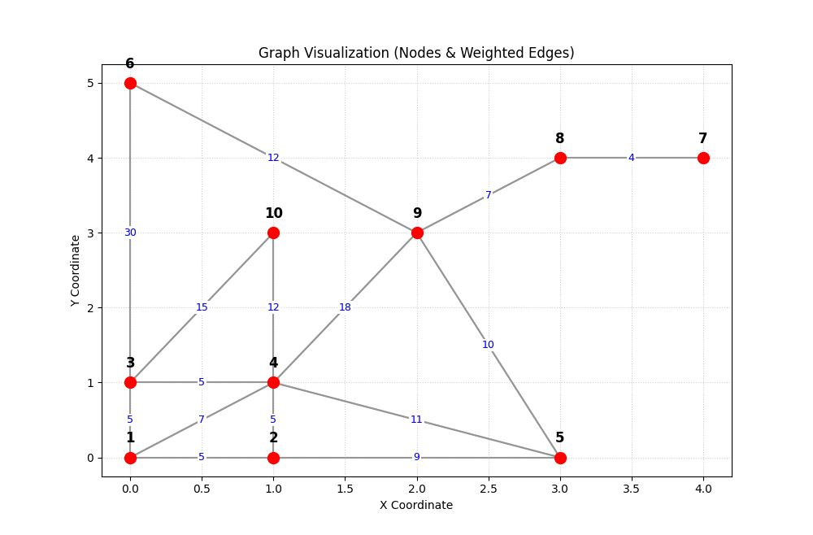

## Running the app locally

### Prerequisites

To run the app locally, you need:
- **Java 17** or later
- **Maven** 3.9+
- **Docker**
- **minikube** and **kubectl** (for Kubernetes deployment)

#### Installing minikube (for Kubernetes)

```bash
curl -LO https://storage.googleapis.com/minikube/releases/latest/minikube-linux-amd64
sudo install minikube-linux-amd64 /usr/local/bin/minikube
rm minikube-linux-amd64
```

#### Installing kubectl

```bash
curl -LO "https://dl.k8s.io/release/$(curl -L -s https://dl.k8s.io/release/stable.txt)/bin/linux/amd64/kubectl"
sudo install -o root -g root -m 0755 kubectl /usr/local/bin/kubectl
rm kubectl
```

### Downloading the graph

The files in `./data/` correspond to a very small mock graph which looks like this:



(all the edges are undirected).

In order to use a larger graph, you have to download it first.
You can download it from [here](https://www.diag.uniroma1.it/challenge9/download.shtml).
You need to put the file with coordinates under `./data/graph.co.gz` and the one
with arcs under `./data/graph.gr.gz` for the Docker containers to work properly.

### Running the Java programs on their own

To build Java apps just run
```
mvn clean install
```
This should create two `.jar` files: `leader/target/leader-1.0-SNAPSHOT.jar` and
`worker/target/worker-1.0-SNAPSHOT.jar`, which you can run with
```
java -jar worker/target/worker-1.0-SNAPSHOT.jar
```
and similarly for the leader. However ***running the apps this way is discouraged***
as it would be quite difficult to make the workers communicate with the leader. Instead,

### Running with Kubernetes (minikube) - Recommended

This is the recommended approach if you plan to deploy to Google Cloud later.

#### 1. Start minikube

```bash
./minikube_start.sh
```

Or manually:
```bash
minikube start --driver=docker --cpus=4 --memory=4096 --disk-size=20g
```

#### 2. Build images for Kubernetes

```bash
./k8s_build.sh
```

#### 3. Deploy to Kubernetes

```bash
./k8s_deploy.sh
```

This script will:
- Mount your `./data` directory to minikube
- Create the namespace and all Kubernetes resources
- Start the workers and then the leader job

#### Useful kubectl commands

```bash
# View all pods
kubectl get pods -n graph-dist

# Watch pod status
kubectl get pods -n graph-dist -w

# View leader logs
kubectl logs -n graph-dist -l app=graph-leader -f

# View worker logs
kubectl logs -n graph-dist worker-0 -f
```

#### Cleaning up

```bash
./k8s_cleanup.sh   # Remove Kubernetes resources
./minikube_stop.sh # Stop minikube
```

## Running the app on Google Cloud (GKE)

### Prerequisites

1. Install and configure the [Google Cloud SDK](https://cloud.google.com/sdk/docs/install)
2. Authenticate: `gcloud auth login`
3. Set your project: `gcloud config set project YOUR_PROJECT_ID`

### Create a GKE cluster

```bash
gcloud container clusters create graph-cluster \
    --zone us-central1-a \
    --num-nodes 3 \
    --machine-type e2-medium
```

### Configure kubectl for GKE

```bash
gcloud container clusters get-credentials graph-cluster --zone us-central1-a
```

### Push images to Google Container Registry

```bash
# Build images locally first
./k8s_build.sh

# Tag images for GCR
docker tag graph-worker:v1 gcr.io/YOUR_PROJECT_ID/graph-worker:v1
docker tag graph-leader:v1 gcr.io/YOUR_PROJECT_ID/graph-leader:v1

# Push to GCR
docker push gcr.io/YOUR_PROJECT_ID/graph-worker:v1
docker push gcr.io/YOUR_PROJECT_ID/graph-leader:v1
```

### Deploy to GKE

1. Update image references in `k8s/*.yaml` files:
   - Change `image: graph-worker:v1` to `image: gcr.io/YOUR_PROJECT_ID/graph-worker:v1`
   - Change `image: graph-leader:v1` to `image: gcr.io/YOUR_PROJECT_ID/graph-leader:v1`
   - Change `imagePullPolicy: Never` to `imagePullPolicy: Always`

2. Upload graph data to a GCS bucket or use a different storage solution

3. Apply the manifests:
   ```bash
   kubectl apply -f k8s/namespace.yaml
   kubectl apply -f k8s/configmap.yaml
   kubectl apply -f k8s/leader-service.yaml
   kubectl apply -f k8s/worker-statefulset.yaml
   kubectl apply -f k8s/leader-job.yaml
   ```

### Clean up GKE resources

```bash
# Delete the cluster (to avoid charges)
gcloud container clusters delete graph-cluster --zone us-central1-a
```

## Querying for Shortest Paths

The leader exposes a REST API for finding the shortest path between two nodes in the graph.

### API Endpoint

`GET /shortest-path`

### Query Parameters

- `from`: The ID of the starting node.
- `to`: The ID of the ending node.

### Example Usage

#### Using `curl`

You can use `curl` to send a request to the API.

If you are running the application with minikube, the API will be available on `http://localhost:8080`.

```bash
curl "http://localhost:8080/shortest-path?from=1&to=7"
```

#### Using a Web Browser

You can also open the URL in your web browser:
```
http://localhost:8080/shortest-path?from=1&to=7
```

### Example Response

The API will return a JSON object with the distance and the path.

```json
{
  "distance" : 35,
  "path": [1,2,5,9,8,7]
}
```
